```{r setup, include=FALSE}
knitr::opts_chunk$set(echo = FALSE)
```


## Visualizations: 1

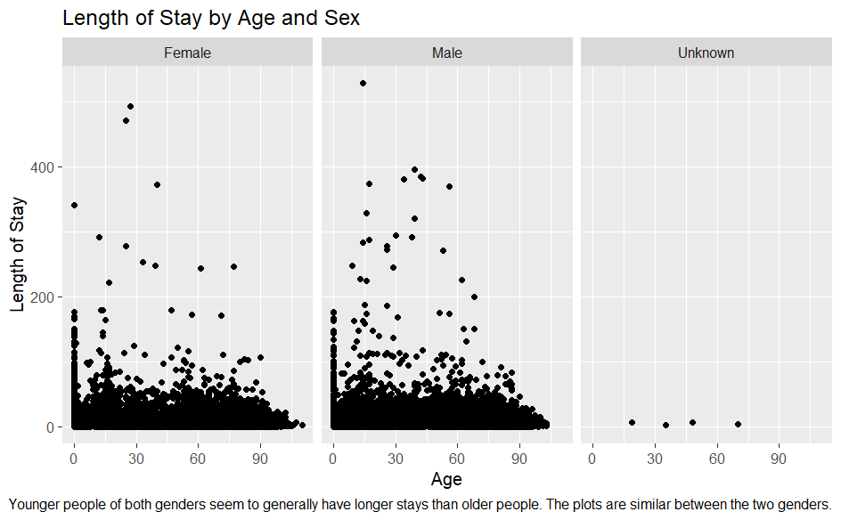{width="80%"}

## Visualizations: 2

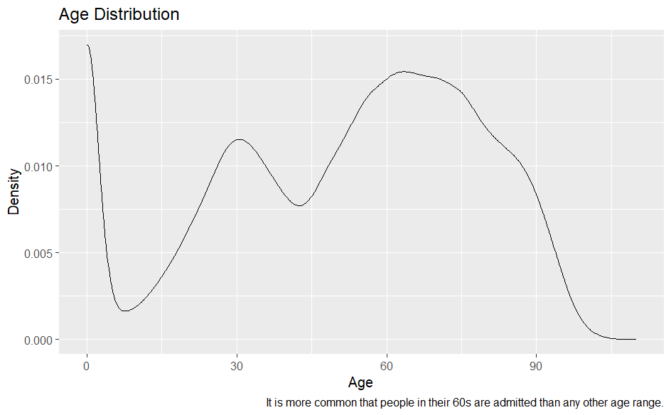{width="80%"}

## Visualizations: 3

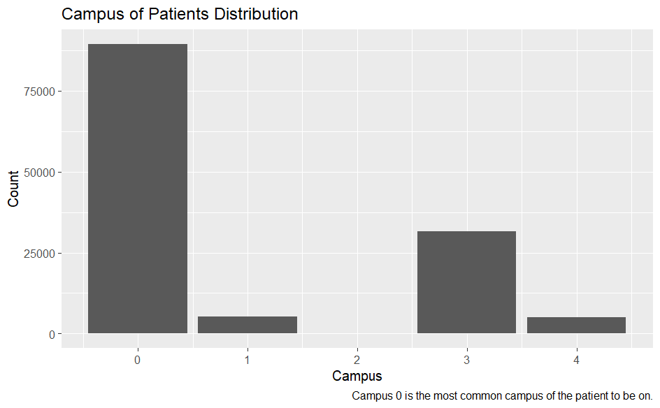{width="80%"}

## Visualizations: 4

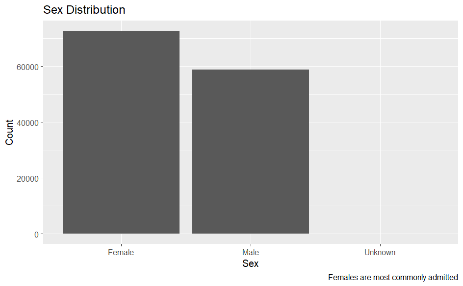{width="80%"}

## Visualizations: 5

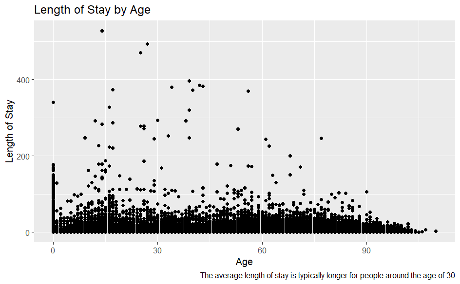{width="80%"}

## Visualizations: 6

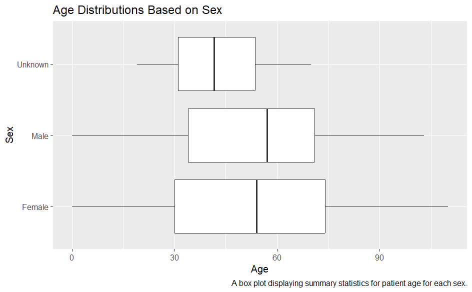{width="80%"}

## Visualizations: 7

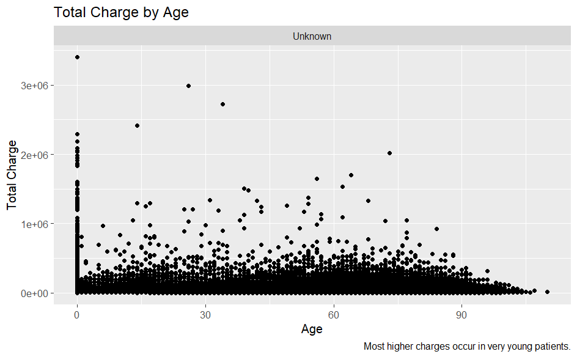{width="80%"}

## Visualizations: 8

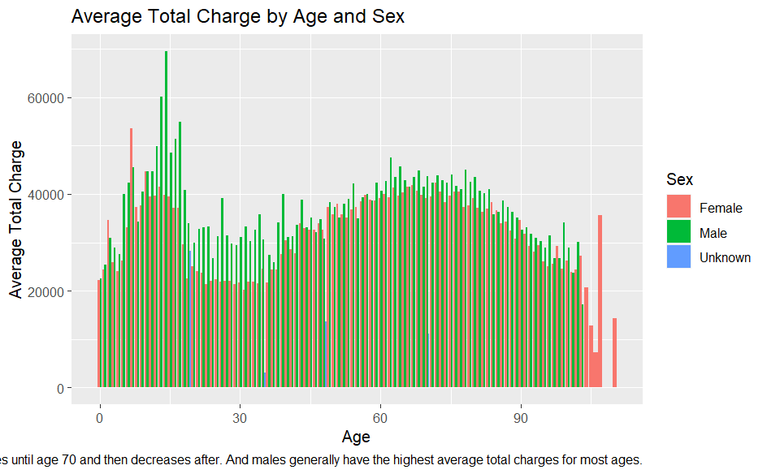{width="80%"}

## Visualizations: 9

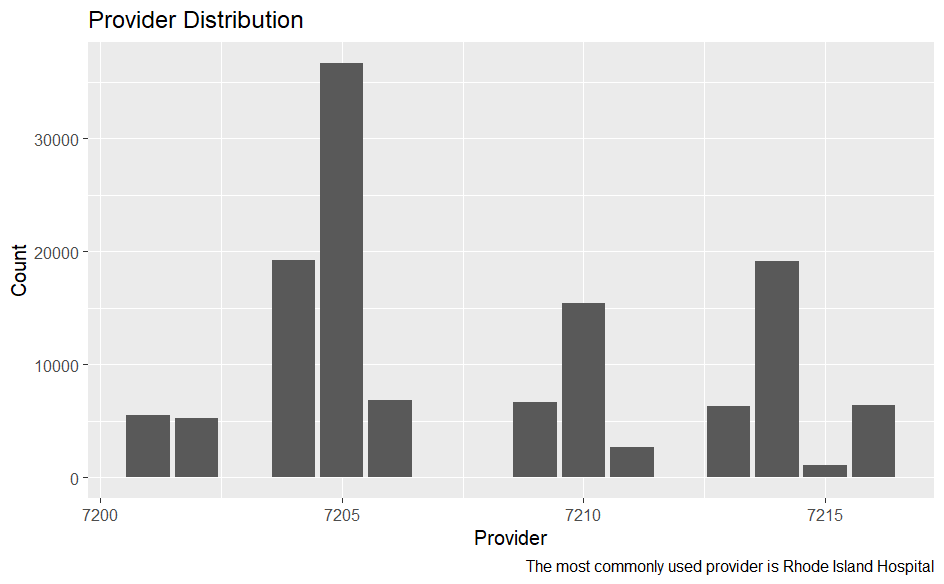{width="80%"}

## Visualizations: 10

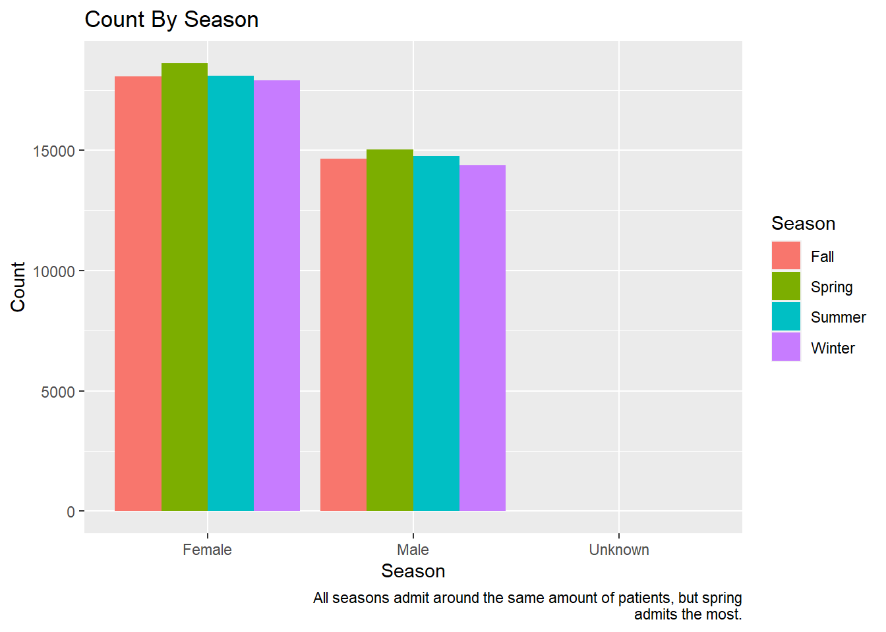{width="80%"}

## Visualizations: GIF

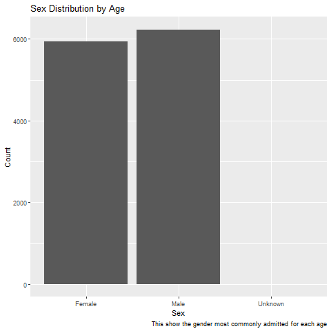{width="80%"}

## Part 3 Question 4 Model Comparison
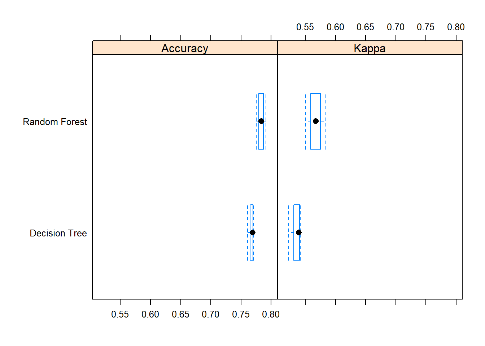{width="80%"}

## Part 3 Question 5 Accuracy Comparison
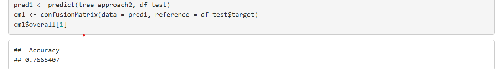{width="80%"}
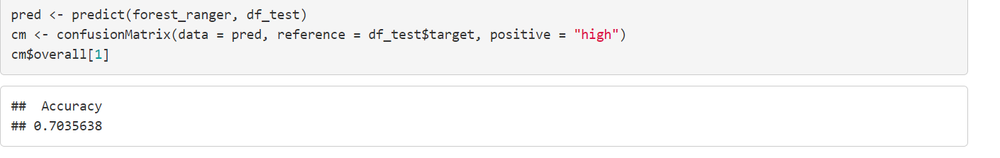{width="80%"}


## Part 3 Question 6 New Model Comparison
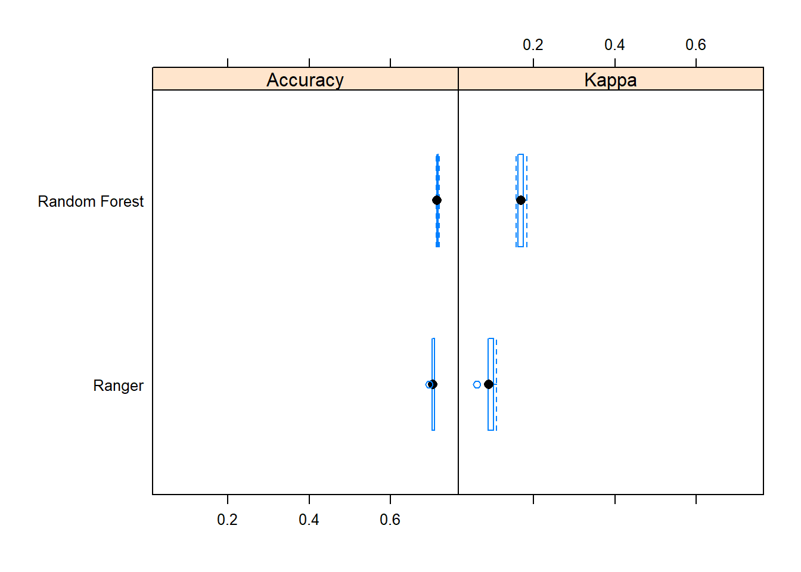{width="80%"}

## Overall Errors and Challenges

1. The file was extremely large so knitting took a while until I figured out how to change it to a csv

2. Keeping track of all the df's that I made and not getting any of the variables confused within each 


